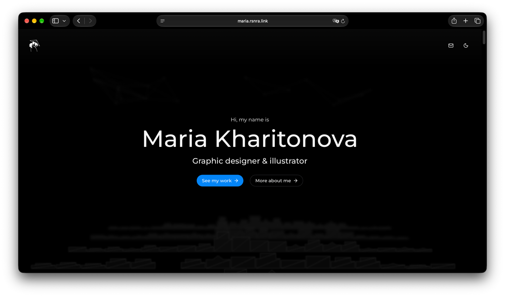

# Maria Portfolio

[](apps/web)
[](apps/web)
[](apps/api)
[](package.json)
[](https://maria.rsnra.link/)

An interactive personal portfolio website designed and built for my friend, a visual designer.


<p align="center">
  
</p>

🌐 **Live Website**: [https://maria.rsnra.link/](https://maria.rsnra.link/)

---

## 🎨 Architectural Rationale: Why a Custom Image Engine Instead of Next.js?

While reaching for Next.js is common for web projects, choosing an independent, tailored architecture here was a deliberate engineering decision:

- **The Right Tool for an Interactive SPA**: Next.js shines when server-side rendering (SSR) is strictly necessary for frequent dynamic page indexing or heavy SEO routing. For a fluid, state-driven designer portfolio SPA loaded with custom animations, full SSR adds server complexity and hydration overhead with little tangible benefit.
- **Superior Image Processing Autonomy**: Rather than relying on generic middleware image optimizers, this project features a purpose-built NestJS/Fastify image engine (`apps/api`) powered by `sharp` and `better-sqlite3`. It provides:
  - Automated content-hash deduplication (SHA-256).
  - Breakpoint-aware AVIF/WebP generation.
  - Hybrid raster/vector SVG classification and minification.
  - Zero-latency serving with self-healing cache reconciliation.
- **Dynamic Luminance / Brightness Map Header**: Because the portfolio features vibrant, continuous art backgrounds and heavy interactive visuals, the header utilizes an active **luminance map calculation**. As the user scrolls across diverse graphic artworks, the header elements dynamically adapt their contrast and text color in real time to match the background brightness underneath.

---

## 📦 Monorepo Architecture

```
apps/web              React 19 + Vite frontend
apps/api              NestJS + Fastify custom image-optimization service
packages/img-client   Shared progressive-image React components & hooks
```

## Development

```
pnpm install
pnpm dev      # runs apps/web (Vite, :5600) and apps/api (Nest, :4100) together via turbo
```

The Vite dev server proxies `/img/*` and `/img-manifest` to `http://localhost:4100` (see
`apps/web/vite.config.ts`), so the frontend only ever talks to its own origin.

Other root scripts: `pnpm build`, `pnpm typecheck`, `pnpm test`, `pnpm lint`.

## apps/api — image optimization engine

Source images live in `apps/api/storage/` (this is what "uploading a new asset" means —
drop the file there, nothing else). All optimized output and the cache index database live
in `apps/api/.cache/` (gitignored, fully disposable — delete it and the engine rebuilds
everything from `storage/` on next boot).

### How caching works

`apps/api/.cache/index.sqlite` (better-sqlite3 via TypeORM) is the source of truth for
"what cached variants should exist"; `apps/api/.cache/files/` holds the actual generated
files. Two tables:

- `source_files` — one row per file in `storage/`, keyed by relative path, with its real
  content hash (sha256 of the file bytes, not just size/mtime), intrinsic dimensions, and
  an inline LQIP placeholder.
- `cache_variants` — one row per generated output (a given width × format × quality, or a
  minified SVG shell), pointing at its filename under `.cache/files/`.

A file-system watcher (`WatcherService`, chokidar) reconciles every file in `storage/`:

- **New file** → hashed, classified, and every breakpoint × format variant is generated.
- **Content actually changed** (hash mismatch against the DB record) → all of that file's
  cached variants are deleted and regenerated from scratch.
- **Hash unchanged, but a cache file is physically missing** (partial cleanup, disk hiccup,
  manual `rm`) → only the missing variant is regenerated; everything else is left alone.
- **File deleted from `storage/`** → its DB rows and cache files are removed.

This reconciliation runs once for every pre-existing file at startup (cache warmup), on every
`add`/`change` filesystem event while the server is running, and on a slow periodic sweep
(hourly) as defense-in-depth against cache files disappearing without a filesystem event.
The `GET /img/*` request path itself never re-hashes a file per request — it only consults
the DB and self-heals a single missing variant if needed, so serving stays fast.

### SVG handling

SVGs are classified as `svg-vector` (pure vector) or `svg-with-raster` (has one or more
`<image>` tags with embedded base64 raster data — common for painted/textured art assets).

- `svg-vector` gets one cached "vector" variant: structurally minified via SVGO
  (`preset-default` + explicit `removeScripts` + stripping of `on*` event-handler
  attributes — preset-default alone does **not** sanitize scripts/handlers).
- `svg-with-raster` gets one variant per breakpoint: the embedded raster(s) are downscaled/
  recompressed to that breakpoint's width via `sharp`, then the shell is run through the
  same SVGO pass. Intrinsic width/height are always read from the untouched source file
  before any optimization, never from a processed variant.

`svg-with-raster` additionally gets a flattened `webp` per breakpoint, which is what Safari
actually displays: it composites a raster `<image>` inside a live SVG through a permanently
soft path regardless of source resolution, so a plain rasterized `` is used instead.
The inline SVG is still mounted there, invisible, because the id-based position hooks
measure it with `getBBox()`/`getCTM()`.

### Raster masters (pre-rendered PNGs)

Those flattened renditions can be built from a pre-rendered PNG placed next to the source:
`arts/1-1.svg` pairs with `arts/1-1.svg.master.png`. When one exists the server just
downscales it; when it doesn't, the server rasterizes the SVG itself through librsvg, which
costs seconds per variant and resolves fonts through the prod box's fontconfig rather than
yours.

```
pnpm --filter @maria-portfolio/api masters   # --force, --width 3840, --only <substring>
```

Run it locally — the rendering machine's fonts are what get baked in, which is the whole
point. A master exported by hand from Figma/Illustrator is equally valid (and preferable
where a design tool renders effects librsvg doesn't support); the server only cares that a
PNG exists at that path. Masters are committed alongside their sources so prod gets them
with a plain `git pull`.

Both files' bytes are folded into the source's `contentHash`, so replacing only the master
still invalidates every cached variant and busts the client's `?v=` URL.

### Endpoints

- `GET /img/*` — serves an optimized variant. Query params: `w` (target width), `dpr`
  (device pixel ratio, multiplies `w`), `format` (`webp`/`avif`/`png`/`jpeg`, otherwise
  negotiated from `Accept`), `q` (quality). SVGs always serve as `image/svg+xml`.
- `GET /img-manifest` — `{ [relativePath]: { lqip, breakpoints, type, intrinsic } }` for
  every indexed file, used by `packages/img-client` to pick a breakpoint and render an
  inline LQIP before the real image loads.

### Config

Zod-validated env (`apps/api/src/config.ts`): `PORT` (4100), `HOST` (0.0.0.0),
`STORAGE_DIR`, `CACHE_DIR`, `CORS_ORIGIN`.

## Production deployment

`apps/api` and `apps/web` are two separate processes. `apps/web/server.js` (the prod static
file server) proxies `/img/*` and `/img-manifest` to `apps/api` via `@fastify/http-proxy`,
so only `apps/web`'s port needs to be publicly exposed. Point it at the api service with:

```
API_URL=http://<api-host>:4100   # defaults to http://127.0.0.1:4100 (co-located deploy)
```

Build and run both:

```
pnpm build
pnpm --filter @maria-portfolio/api start   # apps/api/dist/src/main.js
pnpm --filter @maria-portfolio/web start   # apps/web/server.js
```
